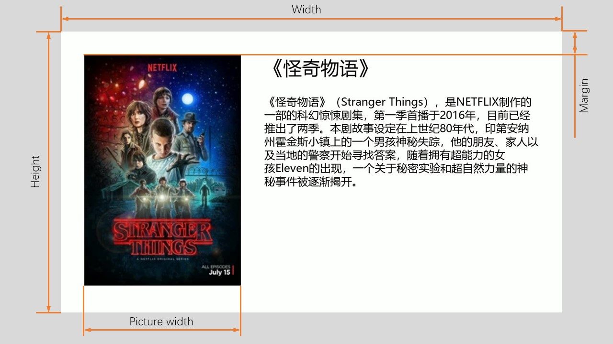
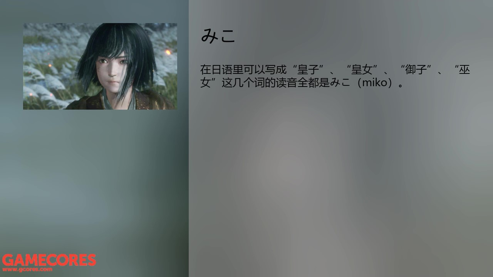

# Gadio Video Generator

本代码库的作用是利用gcores网站的图文电台时间轴信息自动生成视频。

## 使用说明

### 安装依赖包

```bash
pip3 install -r requirements.txt
```

### 运行示例

如果需要生成 `https://www.gcores.com/radios/107884` 中的电台的视频，在控制台中运行：

```bash
python main.py 107884
```

图片暂存于`.\resource\107884\`中，视频合成后会自动清除。图片的名称为图片在视频中最初出现的秒数。由于暂不支持gif图片，因此gif图片在视频合成后不会清除，请根据图片名添加到视频相应位置。

视频文件是`.\output\107884.mp4`

### 更改配置

修改`config.py`中的参数可以修改如下配置

|参数|含义|示例|
|:---:|:---|:---:|
|fps|帧率|3|
|width|视频宽度|1280|
|height|视频高度|720|
|margin|边界宽度|60|
|picture_width|图片宽度（图片过高时会以高度为准）|400|
|title_font_size|标题字体大小|48|
|content_font_size|正文字体大小|28|
|title_color|标题字体颜色|#424242|
|content_color|正文字体颜色|#424242|
|background_color|背景颜色|#FFFFFF|
|font|字体|msyh.ttc|

尺寸实例见下图



## TODO

* 支持 gif
* 合并音频

---

## **预览版**

您可以切换至`fancy`分支使用预览版。预览版使用`moviepy`库来合成视频，已经支持了gif、合并音频、图片间转场等功能。每一页的背景改为模糊的图片。

## 预览版使用说明

### 预览版运行示例

如果需要生成 `https://www.gcores.com/radios/107884` 中的电台的视频，在控制台中运行：

```bash
python update.py 107884
```

由于此版本包含转场动画和gif，因此帧数要求比较高，合成视频比较慢。

### 预览版配置说明

|参数|含义|示例|
|:---:|:---|:---:|
|fps|帧数|1|
|animation_fps|包含动画及转场的视频帧数|30|
|width|视频宽度|1280|
|height|视频高度|720|
|margin|边界宽度|60|
|picture_width|图片宽度（图片过高时会以高度为准）|400|
|title_font_size|标题字体大小|48|
|content_font_size|正文字体大小|28|
|title_color|标题字体颜色|#050505|
|content_color|正文字体颜色|#050505|
|background_color|背景颜色|#FFFFFF|
|font|字体|msyh.ttc||
|logo_name|logo图片名（位于`.\util`文件夹下）|logo.png||
|fade_duration|转场动画持续时间|1|
|test|是否是测试模式。测试模式时只渲染前10段视频，不超过200秒|False|
|enable_logo|是否添加logo|True|

实例见下图




视频示例请参考

[哔哩哔哩](https://www.bilibili.com/video/av49033861)