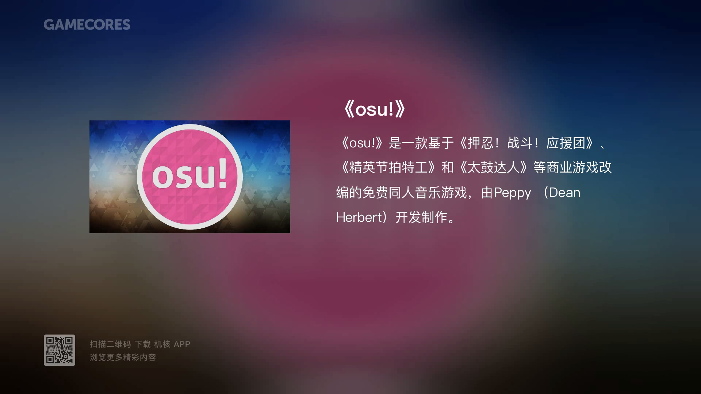

# Gadio Video Generator

|Platform|Test Result|
|:---:|:---:|
|Windows|[](https://rabbitism.visualstudio.com/GadioVideo/_build/latest?definitionId=2)|
|macOS|[](https://rabbitism.visualstudio.com/GadioVideo/_build/latest?definitionId=1)|

本脚本的作用是利用[机核网](https://www.gcores.com)的图文电台时间轴信息自动生成视频。

## 运行环境

python 3.5, 3.6, 3.7

## 使用说明

本脚本可以生成三种不同规格的视频

||Simple|Complex|Animated|
|:---|:---:|:---:|:---:|
|时间校对|:heavy_check_mark:|:heavy_check_mark:|:heavy_check_mark:|
|文本|:heavy_check_mark:|:heavy_check_mark:|:heavy_check_mark:|
|图片|:heavy_check_mark:|:heavy_check_mark:|:heavy_check_mark:|
|亚克力背景|:x:|:heavy_check_mark:|:heavy_check_mark:|
|logo/水印|:x:|:heavy_check_mark:|:heavy_check_mark:|
|声音|:x:|:heavy_check_mark:|:heavy_check_mark:|
|转场动画|:x:|:x:|:heavy_check_mark:|
|GIF动画|:x:|:x:|:heavy_check_mark:|
|建议帧数|0-5 fps|0-5 fps|20-39 fps|
|常规用时|3 min|15 min|150 min|

具体使用方法请参考各自章节

### 安装依赖

```bash
pip3 install -r requirements.txt
```

### 运行示例

以 `https://www.gcores.com/radios/107884` 中的电台为例：

1. 如果想要生成Simple样式版本的视频可运行

```bash
python simple.py 107884
```

2. 如果想要生成Complex样式版本的视频可运行

```bash
python complex.py 107884
```

3. 如果想要生成Animated样式版本的视频可运行

```bash
python animated.py 107884
```

此外
如果想单独爬去文本和图片不生成视频，可运行

```bash
python crawler.py 107884
```

图片暂存于`.\resource\107884\`中。图片的名称为图片在视频中最初出现的秒数。

想跳过爬虫直接用已经爬好的图片和文字生成视频，可在上面生成视频的命令后加-s:

```bash
python simple.py 107884 -s
python complex.py 107884 -s
python animated.py 107884 -s
```

生成的视频文件位于 `output` 文件夹内

### 更改配置

修改`config.py`中的参数可以修改如下配置

|参数|含义|示例|注释|
|:---:|:---|:---:|:---|
|fps|帧率|3|
|animation_fps|动画帧率|24|animated版本视频帧率|
|width|视频宽度|1280|
|height|视频高度|720|
|margin|边界宽度|60|
|picture_width|图片宽度|400|图片过高时会以高度为准|
|title_font_size|标题字体大小|48|
|content_font_size|正文字体大小|28|
|title_color|标题字体颜色|#424242|
|content_color|正文字体颜色|#424242|
|background_color|背景颜色|#FFFFFF|
|font|字体|./util/SourceHanSans-Regular.ttc|如果使用系统自带字体，直接写字体文件名|
|logo_name|logo图片文件名|logo.png|logo文件应放在util文件夹下|
|fade_duration|渐变时间|1|两张图片间转场的时间长度，单位为秒|
|test|测试模式|False|在测试模式下之生成前10段视频，最长不超过200秒|
|enable_logo|是否增加logo|True|是否在视频左下角增加logo|
|skip_gif|是否跳过gif|False|是否在animated版本中跳过插入gif图片|

尺寸和实例见下图




视频示例请参考

[哔哩哔哩](https://www.bilibili.com/video/av59856563)